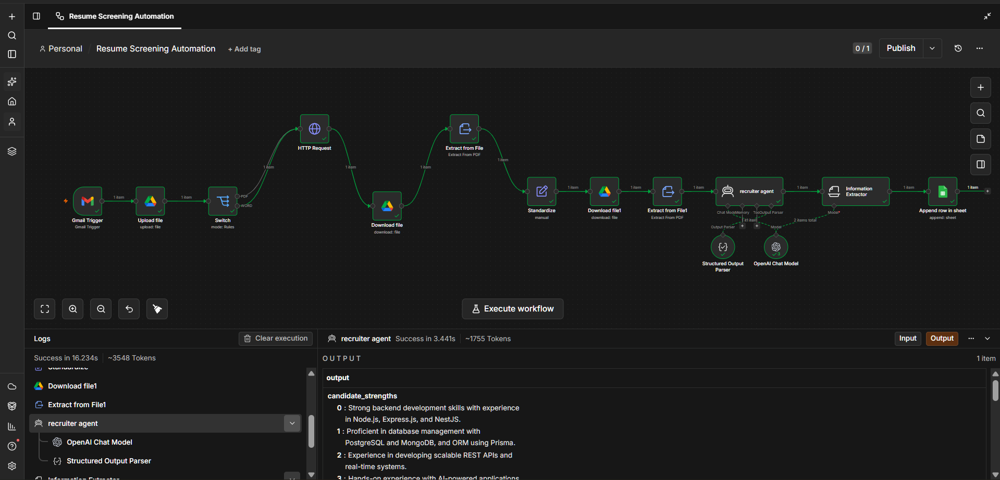

# AI Resume Screening Automation

An n8n workflow that automatically screens incoming resumes from Gmail, extracts candidate information regardless of file format, and uses an AI recruiter agent to evaluate fit — logging everything to a Google Sheet.



## How it works

1. **Gmail Trigger** watches an inbox for incoming resume emails.
2. **Upload file** saves the email attachment to Google Drive.
3. **Switch** routes the file by type — `PDF`, `WORD`, or `TEXT` — since each format needs a different extraction path.
4. **Download + Extract from File** pulls the raw file back down and converts it into plain text (PDF via native extraction, Word via Google Docs conversion + export as `text/plain`).
5. **Standardize** merges all three branches into one consistent data shape before the AI step.
6. **Recruiter Agent** (OpenAI Chat Model + Structured Output Parser) reads the resume text and produces a structured evaluation — strengths, weaknesses, risk factor, reward factor, overall fit, and justification.
7. **Append row in sheet** logs the candidate and evaluation into a Google Sheet for the hiring team to review.

## Tech stack

- [n8n](https://n8n.io) (workflow automation)
- Google Drive & Google Sheets APIs
- Gmail Trigger
- OpenAI Chat Model (GPT) via LangChain-style Information Extractor / Agent nodes
- Structured Output Parser for consistent JSON output

## Project structure

```
.
├── Resume Screening Automation.json   # Exportable n8n workflow
├── prompts/
│   ├── extractor_prompt.md            # System prompt for resume field extraction
│   └── recruiter_prompt.md            # System prompt for the recruiter evaluation agent
├── screenshots/
│   ├── Workflow.png
│   ├── Architacture.png
│   └── sheet.png
├── LICENSE
└── README.md
```

## Setup

1. Import `Resume Screening Automation.json` into your n8n instance.
2. Connect credentials:
   - Gmail (trigger)
   - Google Drive (upload/download)
   - Google Sheets (append row)
   - OpenAI (chat model)
3. Update the **Switch** node's rules if your incoming mimeTypes differ.
4. Update the **Google Sheet** ID in the "Append row in sheet" node to point at your own sheet, with columns matching:

   `Date | Resume | First name | Last name | Email | Phone number | Strengths | Weakness | Risk factor | Reward factor | Overall fit | Justification`

5. Paste the contents of `prompts/extractor_prompt.md` and `prompts/recruiter_prompt.md` into their respective nodes.
6. Activate the workflow.

## Supported file types

| Format | Extraction method |
|--------|-------------------|
| PDF    | n8n "Extract from File" → Extract From PDF |
| DOCX   | Google Drive conversion to Google Docs → export as plain text |
| TXT    | n8n "Extract from File" → Extract from text file |

## Roadmap

- [ ] Wire up the TEXT branch end-to-end
- [ ] Add Slack/email notification on high-fit candidates
- [ ] Support batch re-scoring of historical resumes

## License

See [LICENSE](LICENSE).