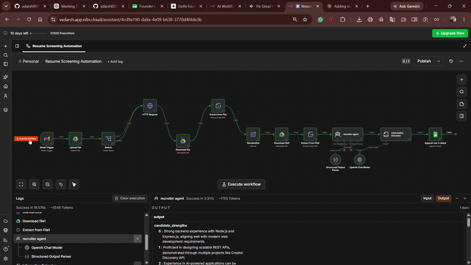
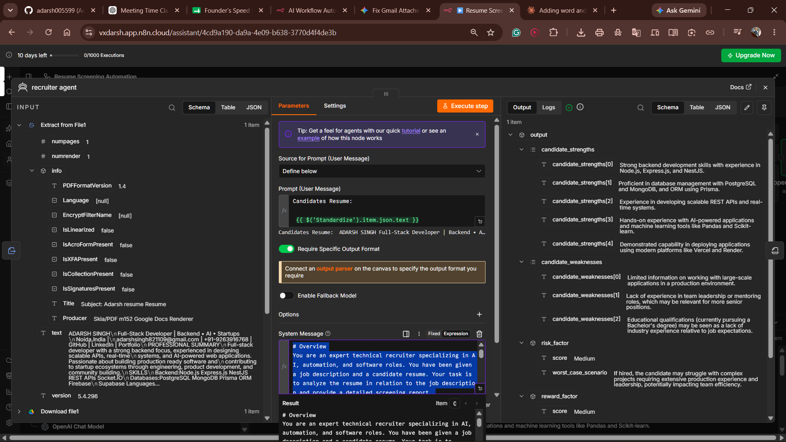
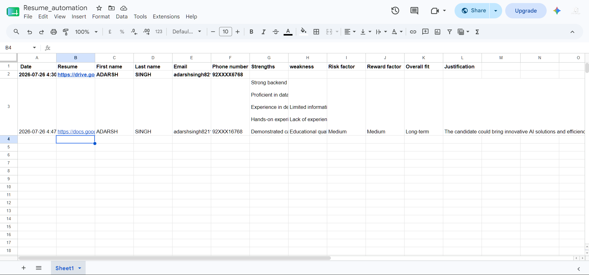

<div align="center">

# 🤖 AI Resume Screening Automation

### Automatically screen resumes from Gmail using AI — no manual sorting, no missed candidates.

[](https://n8n.io)
[](https://openai.com)
[](https://developers.google.com/drive)
[](https://developers.google.com/sheets)
[](LICENSE)

</div>

---

## 📖 Overview

**AI Resume Screening Automation** is an n8n workflow that watches a Gmail inbox for incoming resumes, extracts candidate information regardless of file format (PDF, Word, or plain text), and hands the resume off to an AI recruiter agent for evaluation. Every candidate — along with their AI-generated strengths, weaknesses, and overall fit score — gets logged automatically into a Google Sheet for the hiring team to review.

No manual downloading, copy-pasting, or reading resumes one by one. Just connect your inbox and let the pipeline run.

<div align="center">

</div>


## ⚙️ How It Works

| Step | Node | What it does |
|------|------|---------------|
| 1️⃣ | **Gmail Trigger** | Watches an inbox for incoming resume emails |
| 2️⃣ | **Upload file** | Saves the email attachment to Google Drive |
| 3️⃣ | **Switch** | Routes the file by type — `PDF`, `WORD`, or `TEXT` |
| 4️⃣ | **Download + Extract from File** | Converts the file into plain text (PDF via native extraction, Word via Google Docs conversion + `text/plain` export) |
| 5️⃣ | **Standardize** | Merges all three branches into one consistent data shape |
| 6️⃣ | **Recruiter Agent** | OpenAI Chat Model + Structured Output Parser evaluates the candidate |
| 7️⃣ | **Append row in sheet** | Logs the candidate + evaluation into Google Sheets |

<div align="center">

</div>

---

## 🧠 The AI Evaluation

The **Recruiter Agent** doesn't just extract text — it evaluates the candidate the way a real recruiter would, producing:

- ✅ **Strengths** — concrete, evidence-based positives from the resume
- ⚠️ **Weaknesses** — honest gaps or concerns
- 🎯 **Risk factor** — Low / Medium / High
- 🚀 **Reward factor** — Low / Medium / High
- 📊 **Overall fit** — a clear one-line verdict
- 📝 **Justification** — reasoning tied to specific resume content

All of this flows straight into a live spreadsheet:

<div align="center">

</div>

---

## 🛠️ Tech Stack

- [**n8n**](https://n8n.io) — workflow automation engine
- **Google Drive & Google Sheets APIs** — file storage and reporting
- **Gmail Trigger** — inbox monitoring
- **OpenAI Chat Model (GPT)** — via LangChain-style Agent + Information Extractor nodes
- **Structured Output Parser** — enforces consistent, parseable JSON output

---

## 📁 Project Structure

```
.
├── Resume Screening Automation.json   # Exportable n8n workflow
├── prompts/
│   ├── extractor_prompt.md            # System prompt for resume field extraction
│   └── recruiter_prompt.md            # System prompt for the recruiter evaluation agent
├── screenshots/
│   ├── Workflow.png
│   ├── Architacture.png
│   └── sheet.png
├── LICENSE
└── README.md
```

---

## 🚀 Setup

### 1. Import the workflow
Import `Resume Screening Automation.json` into your n8n instance.

### 2. Connect credentials
- 📧 Gmail (trigger)
- 📁 Google Drive (upload/download)
- 📊 Google Sheets (append row)
- 🤖 OpenAI (chat model)

### 3. Configure the Switch node
Update the **Switch** node's rules if your incoming mimeTypes differ from the defaults.

### 4. Set up your Google Sheet
Point the **Append row in sheet** node at your own sheet, with columns matching:

```
Date | Resume | First name | Last name | Email | Phone number |
Strengths | Weakness | Risk factor | Reward factor | Overall fit | Justification
```

### 5. Add the prompts
Paste the contents of `prompts/extractor_prompt.md` and `prompts/recruiter_prompt.md` into their respective nodes.

### 6. Activate
Turn the workflow on — you're live. 🎉

---

## 📄 Supported File Types

| Format | Extraction Method |
|:------:|--------------------|
| 📕 **PDF**  | n8n "Extract from File" → Extract From PDF |
| 📘 **DOCX** | Google Drive conversion to Google Docs → export as plain text |
| 📄 **TXT**  | n8n "Extract from File" → Extract from text file |

---

## 🗺️ Roadmap

- [ ] Wire up the TEXT branch end-to-end
- [ ] Add Slack/email notification on high-fit candidates
- [ ] Support batch re-scoring of historical resumes

---

## 📜 License

Licensed under the [MIT License](LICENSE).

<div align="center">

Made with ⚡ n8n and 🤖 GPT

</div>
